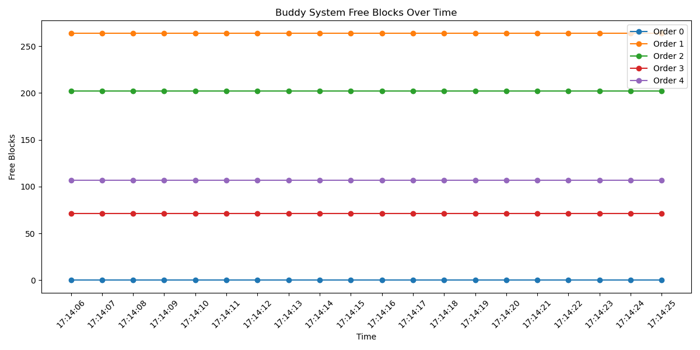

## 实验四：伙伴系统与内存碎片

### 观察结果

#### 4.1 伙伴系统状态分析

**系统Zone分布：**

| Zone | 总空闲内存 | 特点 |
|------|-----------|------|
| DMA | 14.50 MB | 用于ISA设备，内存较小 |
| DMA32 | 122.39 MB | 32位DMA设备可用区域 |
| Normal | 18.77 MB | 主要内存区域 |

**Normal Zone详细分析：**

| Order | 块大小 | 空闲块数 | 空闲内存 |
|-------|--------|---------|----------|
| 0 | 4KB | 164 | 656KB |
| 1 | 8KB | 136 | 1.1MB |
| 2 | 16KB | 94 | 1.5MB |
| 3 | 32KB | 103 | 3.3MB |
| 4 | 64KB | 70 | 4.5MB |
| 5 | 128KB | 12 | 1.5MB |
| 6 | 256KB | 8 | 2MB |
| 7 | 512KB | 9 | 4.6MB |
| 8+ | ≥1MB | 0 | 0KB |

**碎片化指数：66.1%**
- 低阶块(0-2): 66.1%
- 中阶块(3-5): 31.0%
- 高阶块(6+): 2.9%

#### 4.2 伙伴系统监控图表



图表显示了20秒内伙伴系统各Order空闲块数的变化情况。

#### 4.3 内存碎片化测试

测试分配1000个64KB块（共62MB）：

```
分配前 MemFree: 191,776 KB
分配后 MemFree: 126,508 KB
```

**间隔释放后（制造碎片）：**
- 释放了500块（31MB）
- 尝试分配1MB：成功
- 尝试分配10MB：成功

#### 4.4 perf性能分析

```
Performance counter stats for './exp4_fragmentation':

            18,883      faults
                 0      major-faults
            18,883      page-faults

       0.119900790 seconds time elapsed
       0.022781000 seconds user
       0.097069000 seconds sys
```

**perf report调用图分析：**

```
# Samples: 397  of event 'page-faults'
# Event count (approx.): 18904

    93.96%    93.96%  exp4_fragmentation  libc.so.6  [.] __memset_avx2_unaligned_erms
     5.70%     5.70%  exp4_fragmentation  libc.so.6  [.] _int_malloc
```

- 93.96%的缺页由`memset`操作触发（写入分配的内存）
- 5.70%的缺页由`malloc`内部操作触发

#### 4.5 伙伴系统工作原理

```
Order说明（以4KB页为基准）:
Order 0: 2^0 = 1页   = 4KB
Order 1: 2^1 = 2页   = 8KB
Order 2: 2^2 = 4页   = 16KB
Order 3: 2^3 = 8页   = 32KB
...
Order 10: 2^10 = 1024页 = 4MB
```

**分配算法：**
1. 请求大小转换为Order
2. 查找对应Order空闲链表
3. 若无空闲块，向更高Order拆分（伙伴分裂）
4. 释放时，检查伙伴块是否可合并

### 遇到的问题与解决

1. **matplotlib未安装**
   - 解决：`sudo apt install python3-matplotlib`

2. **perf权限限制**
   - 问题：`perf_event_paranoid`设置为4，禁止用户空间性能监控
   - 解决：`sudo sh -c 'echo 1 > /proc/sys/kernel/perf_event_paranoid'`

3. **perf.data文件权限**
   - 解决：使用非sudo方式重新录制，生成用户可读的数据文件

### 思考题

1. **为什么Normal Zone高阶块为0？**
   - 系统运行一段时间后，内存分配释放导致碎片化
   - 高阶块被拆分满足小内存请求
   - 伙伴系统需要连续物理内存才能合并

2. **为什么碎片化测试中仍然能分配大块内存？**
   - 62MB的测试内存相对于系统内存较小
   - 虚拟内存连续，物理内存可以不连续
   - 用户态malloc使用虚拟地址，不需要物理连续

3. **如何减少内存碎片？**
   - 使用合适大小的内存池
   - 避免频繁分配释放不同大小的内存
   - 内核可使用slab分配器减少碎片

### 关键发现

1. **外部碎片严重**：Normal Zone碎片化指数66.1%，无法分配>512KB连续块
2. **DMA32 Zone健康**：有11个4MB大块，碎片化较轻
3. **perf分析**：大部分缺页由memset操作触发（实际写入内存）

### 文件列表

```
exp4_buddy_system/
├── exp4_buddy_monitor.sh    # 完整监控脚本（100秒）
├── exp4_buddy_quick.sh      # 快速监控脚本（20秒）
├── exp4_buddy_analyze.sh    # 详细分析脚本
├── exp4_fragmentation.c     # 碎片测试程序源码
├── exp4_fragmentation       # 编译后可执行文件
├── buddy_log.txt            # 监控数据
├── buddy_analysis.png       # 监控图表
├── perf.data                # perf录制数据
└── 实验四报告.md             # 本报告
```

### 进一步实验

- [ ] 观察高内存压力下的伙伴系统变化
- [ ] 使用compaction机制整理碎片
- [ ] 分析slab分配器如何补充伙伴系统
